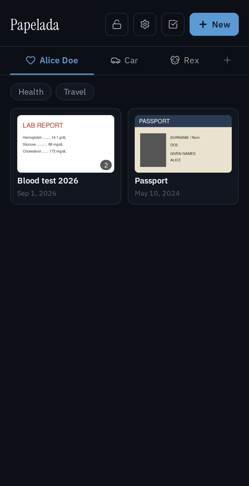
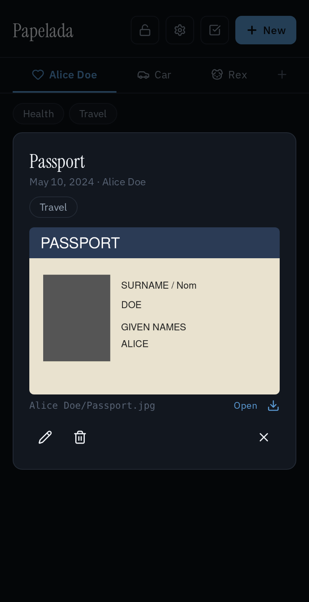
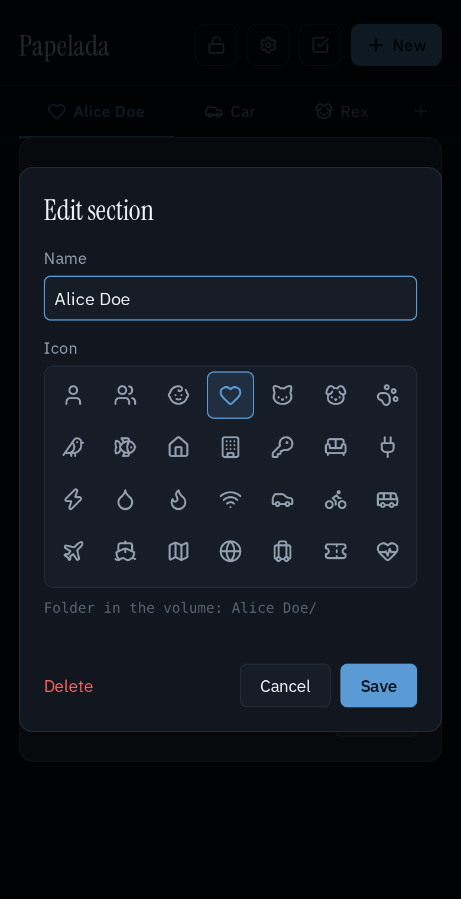

# Papelada

A small self-hosted home for your household's paperwork: IDs, exam results,
receipts, contracts, vaccination cards. Photograph a document with your phone (or
upload any file), file it under a section you created, tag it, and find it again
later.

*Papelada* is Portuguese for "paperwork", or more precisely "a pile of papers".

<p>
  
  
  
</p>

- **Your own sections**, one per person, pet, car, house, or anything else, each with
  an icon you pick. Reorder, rename and delete them any time.
- **Tags** that work across sections (Health, Taxes, Travel...), to filter documents.
- **Multi-page documents**: take one photo per page, straight from the phone camera,
  or add PDFs and any other file.
- **Crop** a photographed page, with the original kept so the crop can be undone.
- **Plain files you can browse.** The documents volume is an ordinary folder tree with
  readable names, so you can open, copy or back it up without the app.
- **Optional encryption at rest**, switchable any time. The key never lives in the volume.
- **Download** a selection of documents as a zip, laid out like the volume.
- English and Brazilian Portuguese, picked from the browser's language.
- One small container: Python (FastAPI) and a plain JS frontend, no database, no
  build step, no third-party requests (fonts and libraries are bundled).

## Your documents on disk

Every section is a folder named after it, and every document a file named after its
title:

```
documents/
├── Alice/
│   ├── Passport.jpg
│   ├── Blood test - 1.jpg      ← a document with two pages
│   └── Blood test - 2.pdf
├── Rex/
│   └── Vaccination card.jpg
└── .papelada/                  ← the app's own data (index, crop backups)
```

Renaming a document or a section in the app renames its files or folder. Two
documents with the same title in one section get `Title.jpg` and `Title (2).jpg`.
Names are kept valid on Windows and macOS too, so the folder works over a network share.

You're free to browse and copy anything in the volume and to add your own files to
it: Papelada ignores files it didn't create and never overwrites them. Don't rename
or move the files Papelada created by hand, though. It keeps track of them by name,
so do that from the app.

## Running it

You need Docker with Compose.

```sh
mkdir papelada && cd papelada
curl -O https://raw.githubusercontent.com/GusFurtado/papelada/main/docker-compose.yml
curl -o .env https://raw.githubusercontent.com/GusFurtado/papelada/main/.env.example
mkdir documents          # or point DOCUMENTS_PATH in .env at an existing folder
docker compose up -d
```

Then open http://localhost:8080.

Create the documents folder yourself before starting. If Docker creates it, it
belongs to root, and Papelada (which never runs as root) can't write to it.

### Configuration

Set these in `.env`, next to `docker-compose.yml`:

| Variable         | Default       | What it does                                                                        |
|------------------|---------------|-------------------------------------------------------------------------------------|
| `DOCUMENTS_PATH` | `./documents` | Folder on the host where your documents are kept (the volume).                      |
| `PORT`           | `8080`        | Port Papelada is served on.                                                         |
| `PUID` / `PGID`  | `1000`        | User and group the app runs as, which own every file it writes. Use `id -u` / `id -g`. |
| `ENCRYPTION_KEY` | *(empty)*     | Enables encryption. See below.                                                      |

To use a Docker secret instead of an environment variable for the key, set
`ENCRYPTION_KEY_FILE` to the secret's path inside the container.

### Encryption

By default, documents are plain files, which is what makes the volume browsable.
That also means anyone who can read the volume, or its backups, can read your
documents.

To encrypt them, generate a key and add it to `.env`:

```sh
openssl rand -base64 32 | tr '+/' '-_'
```

Restart (`docker compose up -d`), then tap the lock icon in the app and choose
**Encrypt everything**. Every file moves from the section folders into
`.papelada/vault/` and is encrypted, along with the index of titles, tags and
dates, so nothing readable is left in the volume. **Decrypt everything** puts it all
back. Both take effect for existing and new documents, and an interrupted switch
finishes by itself on the next start.

**Keep a copy of the key somewhere safe, outside the documents folder.** Without it,
encrypted documents can't be recovered, and Papelada refuses to start without the
right key once the library is encrypted. Keeping the key out of the volume is the
point: a backup of the volume alone doesn't contain it.

### Security

Papelada has no logins. Anyone who can reach it can see and change every
document. Run it on your home network, or put it behind something that
authenticates, such as a VPN (Tailscale, WireGuard), a reverse proxy with
authentication, or Cloudflare Access. The frontend only uses relative URLs, so it
also works under a path prefix (e.g. `https://example.com/papelada/`, trailing slash
included) behind a reverse proxy that strips that prefix.

### Backups

Back up the documents folder: it holds everything, including `.papelada/`. If you
use encryption, back up the key separately.

## Development

```sh
python3 -m venv .venv
.venv/bin/pip install -r requirements-dev.txt
.venv/bin/pytest
DATA_DIR=./data .venv/bin/uvicorn app.main:create_app --factory --reload
```

The frontend is plain HTML, CSS and JS in `frontend/`, served as is. The API is
documented at `/api/docs` while the app runs. `app/storage.py` explains the volume
layout and the encryption switch in detail.

## Credits

Icons from [Lucide](https://lucide.dev) (ISC), image cropping by
[Cropper.js](https://github.com/fengyuanchen/cropperjs) (MIT), and the
[IBM Plex Sans](https://github.com/IBM/plex) and
[Instrument Serif](https://github.com/Instrument/instrument-serif) fonts (SIL OFL).
Their licenses are in `frontend/vendor/`.

## License

[MIT](LICENSE)
